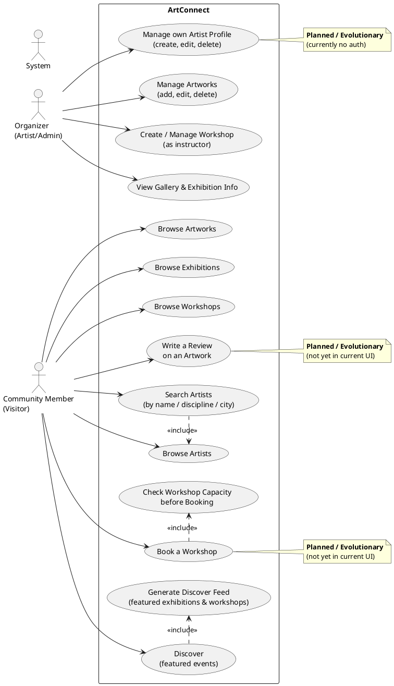
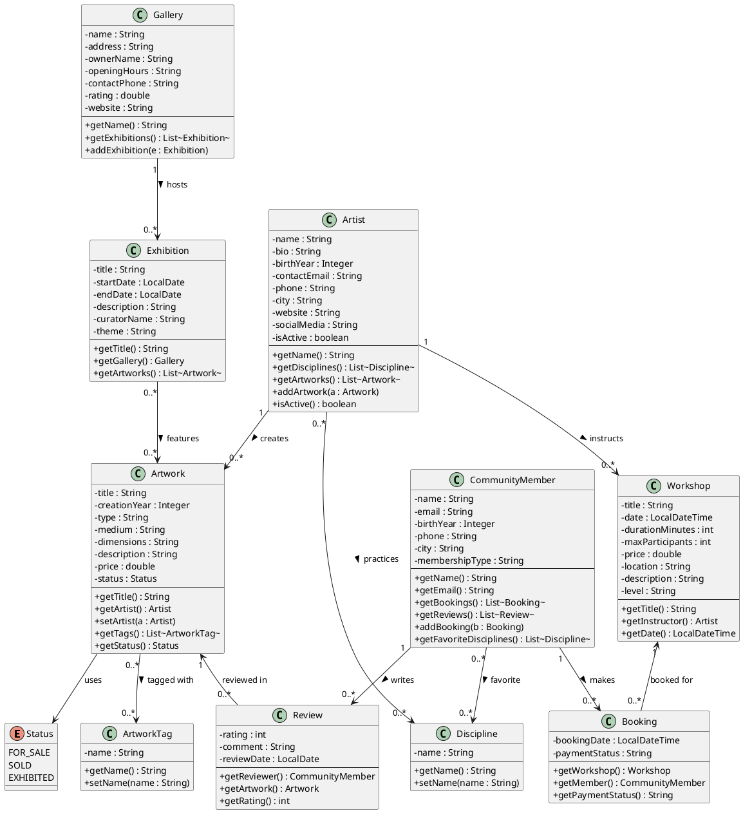
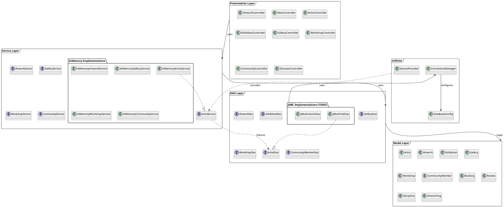

# Step 1 - Understanding ArtConnect & Defining the Functional Scope

## 1. Main Application Features

The application is organized in **7 tabs**:

| Tab | Features (from user perspective) |
|-----|-----------------------------------|
| **Artists** | List all artists · Search by name · Filter by discipline · Filter by city · View artist details (name, city, email, birth year, disciplines) |
| **Artworks** | List all artworks · Filter by artist / type / status · View artwork details (title, type, medium, price, status) |
| **Exhibitions** | List all exhibitions · Filter by gallery / date range · View artworks in an exhibition · View curator and theme |
| **Galleries** | List all galleries · View rating and contact info · Browse exhibitions hosted by a gallery |
| **Workshops** | List all workshops · Filter by level / instructor · View date, location, price, max participants |
| **Community** | List community members · View member bookings · View member reviews · Filter by city / membership type |
| **Discover** | Featured exhibitions (cards) · Upcoming workshops (cards) |

**Planned / Evolutionary Features** (not yet in the interface):
- User authentication and login
- Workshop booking by a community member (button to register)
- Writing and submitting a review on an artwork
- Artist registration / profile creation
- Event notifications / alerts

---

## 2. User Roles / Profiles

### Role 1 — Organizer (Artist / Admin)
- Creates and manages their own artist profile
- Adds, modifies, and deletes their artworks
- Proposes and manages workshops (as instructor)
- Participates in exhibitions organized by galleries
- Has a contact email, phone, website, city, list of disciplines

### Role 2 — Community Member (Visitor)
- Browses artists, artworks, exhibitions, and workshops
- Books spots in workshops
- Writes reviews on artworks (rating 1–5 + comment)
- Has a list of favorite disciplines
- Has a membership type (free or premium)

---

## 3. Use Case Diagram (PlantUML)

**Legend:**
- **Present in current UI**: Browse Artists, Search Artists, Browse Artworks, Browse Exhibitions, Galleries, Browse Workshops, Browse Community, Discover feed
- **Planned (evolutionary)**: Book a Workshop, Write a Review, Manage own Artist Profile, User authentication

---

## 4. Class Diagrams (PlantUML)

### 4a. Model Layer — Domain Classes

### 4b. Architecture — Layer Diagram

---

## 5. Summary of Identified Relationships

| Relationship | Type | Description |
|---|---|---|
| Artist → Artwork | 1:N | One artist creates many artworks |
| Artist → Discipline | N:M | An artist practices multiple disciplines |
| Artist → Workshop | 1:N | An artist instructs multiple workshops |
| Artwork → ArtworkTag | N:M | An artwork has multiple tags |
| Artwork → Review | 1:N | An artwork receives multiple reviews |
| Exhibition → Gallery | N:1 | An exhibition is hosted in one gallery |
| Exhibition → Artwork | N:M | An exhibition features multiple artworks |
| Workshop → Booking | 1:N | A workshop has multiple bookings |
| CommunityMember → Booking | 1:N | A member makes multiple bookings |
| CommunityMember → Review | 1:N | A member writes multiple reviews |
| CommunityMember → Discipline | N:M | A member has multiple favorite disciplines |
