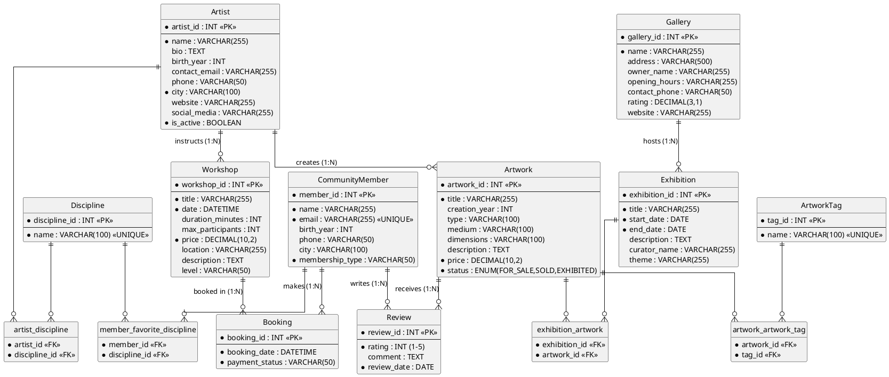

# Step 2 - Conceptual and Logical Modeling of the ArtConnect Database

## 1. Identified Entities and Attributes

Based on the Java model classes and business needs:

| Entity | Attributes | Identifier |
|--------|-----------|------------|
| **Artist** | name, bio, birth_year, contact_email, phone, city, website, social_media, is_active | `artist_id` (new, auto-increment) |
| **Artwork** | title, creation_year, type, medium, dimensions, description, price, status | `artwork_id` (new) |
| **Gallery** | name, address, owner_name, opening_hours, contact_phone, rating, website | `gallery_id` (new) |
| **Exhibition** | title, start_date, end_date, description, curator_name, theme | `exhibition_id` (new) |
| **Workshop** | title, date, duration_minutes, max_participants, price, location, description, level | `workshop_id` (new) |
| **CommunityMember** | name, email, birth_year, phone, city, membership_type | `member_id` (new); `email` is also unique |
| **Booking** | booking_date, payment_status | Composite `(workshop_id, member_id)` or surrogate `booking_id` |
| **Review** | rating, comment, review_date | `review_id` (new) |
| **Discipline** | name | `discipline_id` (new); `name` is unique |
| **ArtworkTag** | name | `tag_id` (new); `name` is unique |

### Functional Dependencies

| Source | → | Target | Note |
|--------|---|--------|------|
| `artist_id` | → | name, bio, birth_year, contact_email, phone, city, website, social_media, is_active | |
| `artwork_id` | → | title, creation_year, type, medium, dimensions, description, price, status, **artist_id** | artist_id is FK |
| `gallery_id` | → | name, address, owner_name, opening_hours, contact_phone, rating, website | |
| `exhibition_id` | → | title, start_date, end_date, description, curator_name, theme, **gallery_id** | gallery_id is FK |
| `workshop_id` | → | title, date, duration_minutes, max_participants, price, location, description, level, **instructor_id** | instructor_id → artist_id |
| `member_id` | → | name, email, birth_year, phone, city, membership_type | |
| `booking_id` | → | **workshop_id**, **member_id**, booking_date, payment_status | both are FKs |
| `review_id` | → | **reviewer_id**, **artwork_id**, rating, comment, review_date | both are FKs |
| `discipline_id` | → | name | |
| `tag_id` | → | name | |

---

## 2. Conceptual Data Model — ERD (PlantUML)



---

## 3. Logical Data Model (LDM)

The following tables result from transforming the CDM into a relational model.  
All Many-to-Many relationships become explicit junction tables.

### 3.0 LDM Diagram (PlantUML)

```plantuml
@startuml ArtConnect_LDM

skinparam linetype ortho
skinparam classAttributeIconSize 0
hide circle
hide empty methods

' ===== Lookup tables =====
class discipline {
  + discipline_id : INT <<PK>>
  --
  + name : VARCHAR(100) <<UNIQUE, NOT NULL>>
}

class artwork_tag {
  + tag_id : INT <<PK>>
  --
  + name : VARCHAR(100) <<UNIQUE, NOT NULL>>
}

' ===== Core tables =====
class artist {
  + artist_id : INT <<PK>>
  --
  + name : VARCHAR(255) <<NOT NULL>>
  + bio : TEXT
  + birth_year : INT
  + contact_email : VARCHAR(255) <<UNIQUE>>
  + phone : VARCHAR(50)
  + city : VARCHAR(100)
  + website : VARCHAR(255)
  + social_media : VARCHAR(255)
  + is_active : BOOLEAN <<NOT NULL, DEFAULT TRUE>>
}

class artwork {
  + artwork_id : INT <<PK>>
  --
  + title : VARCHAR(255) <<NOT NULL>>
  + creation_year : INT
  + type : VARCHAR(100)
  + medium : VARCHAR(100)
  + dimensions : VARCHAR(100)
  + description : TEXT
  + price : DECIMAL(10,2) <<NOT NULL>>
  + status : ENUM('FOR_SALE','SOLD','EXHIBITED') <<NOT NULL>>
  + artist_id : INT <<FK→artist>>
}

class gallery {
  + gallery_id : INT <<PK>>
  --
  + name : VARCHAR(255) <<NOT NULL>>
  + address : VARCHAR(500)
  + owner_name : VARCHAR(255)
  + opening_hours : VARCHAR(255)
  + contact_phone : VARCHAR(50)
  + rating : DECIMAL(3,1)
  + website : VARCHAR(255)
}

class exhibition {
  + exhibition_id : INT <<PK>>
  --
  + title : VARCHAR(255) <<NOT NULL>>
  + start_date : DATE <<NOT NULL>>
  + end_date : DATE <<NOT NULL>>
  + description : TEXT
  + curator_name : VARCHAR(255)
  + theme : VARCHAR(255)
  + gallery_id : INT <<FK→gallery>>
}

class workshop {
  + workshop_id : INT <<PK>>
  --
  + title : VARCHAR(255) <<NOT NULL>>
  + date : DATETIME <<NOT NULL>>
  + duration_minutes : INT
  + max_participants : INT
  + price : DECIMAL(10,2) <<NOT NULL>>
  + instructor_id : INT <<FK→artist>>
  + location : VARCHAR(255)
  + description : TEXT
  + level : VARCHAR(50)
}

class community_member {
  + member_id : INT <<PK>>
  --
  + name : VARCHAR(255) <<NOT NULL>>
  + email : VARCHAR(255) <<UNIQUE, NOT NULL>>
  + birth_year : INT
  + phone : VARCHAR(50)
  + city : VARCHAR(100)
  + membership_type : VARCHAR(50) <<NOT NULL, DEFAULT 'free'>>
}

class booking {
  + booking_id : INT <<PK>>
  --
  + workshop_id : INT <<FK→workshop>>
  + member_id : INT <<FK→community_member>>
  + booking_date : DATETIME <<NOT NULL>>
  + payment_status : VARCHAR(50) <<NOT NULL>>
  .. constraints ..
  UNIQUE (workshop_id, member_id)
}

class review {
  + review_id : INT <<PK>>
  --
  + reviewer_id : INT <<FK→community_member>>
  + artwork_id : INT <<FK→artwork>>
  + rating : INT <<NOT NULL, CHECK 1-5>>
  + comment : TEXT
  + review_date : DATE <<NOT NULL>>
}

' ===== Junction tables =====
class artist_discipline {
  + artist_id : INT <<FK→artist>>
  + discipline_id : INT <<FK→discipline>>
  .. PK(artist_id, discipline_id) ..
}

class member_favorite_discipline {
  + member_id : INT <<FK→community_member>>
  + discipline_id : INT <<FK→discipline>>
  .. PK(member_id, discipline_id) ..
}

class exhibition_artwork {
  + exhibition_id : INT <<FK→exhibition>>
  + artwork_id : INT <<FK→artwork>>
  .. PK(exhibition_id, artwork_id) ..
}

class artwork_artwork_tag {
  + artwork_id : INT <<FK→artwork>>
  + tag_id : INT <<FK→artwork_tag>>
  .. PK(artwork_id, tag_id) ..
}

' ===== 1:N Relationships =====
artist          "1" --o{ artwork              : "artist_id"
artist          "1" --o{ workshop             : "instructor_id"
gallery         "1" --o{ exhibition           : "gallery_id"
artwork         "1" --o{ review               : "artwork_id"
community_member "1" --o{ review              : "reviewer_id"
workshop        "1" --o{ booking              : "workshop_id"
community_member "1" --o{ booking             : "member_id"

' ===== M:N via junction tables =====
artist          "1" --o{ artist_discipline    : ""
discipline      "1" --o{ artist_discipline    : ""

community_member "1" --o{ member_favorite_discipline : ""
discipline       "1" --o{ member_favorite_discipline : ""

exhibition      "1" --o{ exhibition_artwork   : ""
artwork         "1" --o{ exhibition_artwork   : ""

artwork         "1" --o{ artwork_artwork_tag  : ""
artwork_tag     "1" --o{ artwork_artwork_tag  : ""

@enduml
```



### 3.1 Table Descriptions

**`discipline`** — Lookup table for art disciplines  
`discipline_id (PK)` | `name (UNIQUE NOT NULL)`

**`artwork_tag`** — Lookup table for artwork tags  
`tag_id (PK)` | `name (UNIQUE NOT NULL)`

**`artist`** — An artist / creator  
`artist_id (PK)` | `name NOT NULL` | `bio` | `birth_year` | `contact_email (UNIQUE)` | `phone` | `city` | `website` | `social_media` | `is_active NOT NULL DEFAULT TRUE`

**`artwork`** — A work of art created by an artist  
`artwork_id (PK)` | `title NOT NULL` | `creation_year` | `type` | `medium` | `dimensions` | `description` | `price NOT NULL` | `status NOT NULL` | **`artist_id (FK → artist)`**

**`gallery`** — A physical gallery that hosts exhibitions  
`gallery_id (PK)` | `name NOT NULL` | `address` | `owner_name` | `opening_hours` | `contact_phone` | `rating` | `website`

**`exhibition`** — An exhibition hosted in a gallery  
`exhibition_id (PK)` | `title NOT NULL` | `start_date NOT NULL` | `end_date NOT NULL` | `description` | `curator_name` | `theme` | **`gallery_id (FK → gallery)`**

**`workshop`** — A workshop led by an artist  
`workshop_id (PK)` | `title NOT NULL` | `date NOT NULL` | `duration_minutes` | `max_participants` | `price NOT NULL` | **`instructor_id (FK → artist)`** | `location` | `description` | `level`

**`community_member`** — A community member / visitor  
`member_id (PK)` | `name NOT NULL` | `email (UNIQUE NOT NULL)` | `birth_year` | `phone` | `city` | `membership_type NOT NULL DEFAULT 'free'`

**`booking`** — A member's booking for a workshop  
`booking_id (PK)` | **`workshop_id (FK → workshop)`** | **`member_id (FK → community_member)`** | `booking_date NOT NULL` | `payment_status NOT NULL` | `UNIQUE(workshop_id, member_id)`

**`review`** — A member's review of an artwork  
`review_id (PK)` | **`reviewer_id (FK → community_member)`** | **`artwork_id (FK → artwork)`** | `rating NOT NULL (1-5)` | `comment` | `review_date NOT NULL`

**`artist_discipline`** — M:N Artist ↔ Discipline  
**`artist_id (FK → artist)`** | **`discipline_id (FK → discipline)`** | `PK(artist_id, discipline_id)`

**`member_favorite_discipline`** — M:N CommunityMember ↔ Discipline  
**`member_id (FK → community_member)`** | **`discipline_id (FK → discipline)`** | `PK(member_id, discipline_id)`

**`exhibition_artwork`** — M:N Exhibition ↔ Artwork  
**`exhibition_id (FK → exhibition)`** | **`artwork_id (FK → artwork)`** | `PK(exhibition_id, artwork_id)`

**`artwork_artwork_tag`** — M:N Artwork ↔ ArtworkTag  
**`artwork_id (FK → artwork)`** | **`tag_id (FK → artwork_tag)`** | `PK(artwork_id, tag_id)`

---

## 4. Normalization Steps (to 3NF)

### First Normal Form (1NF)
**Rule**: Each column must contain atomic values; no repeating groups.

**Applied**:
- The Java model uses `List<Discipline>` on Artist → extracted to junction table `artist_discipline`.
- The Java model uses `List<ArtworkTag>` on Artwork → extracted to junction table `artwork_artwork_tag`.
- The Java model uses `List<Artwork>` on Exhibition → extracted to junction table `exhibition_artwork`.
- The Java model uses `List<Booking>` and `List<Review>` on CommunityMember → kept as separate tables with FK references.
- The Java model uses `List<Discipline>` on CommunityMember → extracted to `member_favorite_discipline`.
- All multi-valued attributes are now in separate rows, not as comma-separated values.

**Result**: All tables contain only atomic values. ✓

### Second Normal Form (2NF)
**Rule**: Every non-key attribute must depend on the *whole* primary key (applies to composite PKs).

**Applied**:
- The only tables with composite PKs are the junction tables (`artist_discipline`, `member_favorite_discipline`, `exhibition_artwork`, `artwork_artwork_tag`).
- These tables have no non-key attributes → 2NF is trivially satisfied for them.
- `booking` was given a surrogate `booking_id` PK (instead of a composite key) to allow the `booking_date` and `payment_status` attributes to depend on a single PK; the pair `(workshop_id, member_id)` is still enforced with a UNIQUE constraint.
- All other tables have a single surrogate PK (`INT AUTO_INCREMENT`) → 2NF is satisfied for all. ✓

### Third Normal Form (3NF)
**Rule**: No non-key attribute may transitively depend on the primary key (i.e., non-key attribute must not depend on another non-key attribute).

**Applied and verified table by table**:

| Table | Transitive Dependencies? | Action |
|-------|--------------------------|--------|
| `artist` | None. All attributes (name, bio, city, etc.) depend directly on `artist_id`. | ✓ |
| `artwork` | None. `artist_id` is a FK, not a derived value. `status` depends on `artwork_id` only. | ✓ |
| `gallery` | None. `rating`, `address`, etc. all depend on `gallery_id`. | ✓ |
| `exhibition` | None. `curator_name` and `theme` depend on `exhibition_id`, not on `gallery_id`. | ✓ |
| `workshop` | None. `level` and `location` depend on `workshop_id`. `instructor_id` is a FK. | ✓ |
| `community_member` | None. `membership_type` depends on `member_id`, not on `city` or `email`. | ✓ |
| `booking` | None. `payment_status` depends on `booking_id` directly. | ✓ |
| `review` | None. `rating` and `comment` depend on `review_id`, not transitively on `artwork_id`. | ✓ |
| Junction tables | No non-key attributes at all. | ✓ |

**Result**: No transitive dependencies exist. All tables are in 3NF. ✓

---

## 5. Database Schema Summary (Visual)

```
discipline(discipline_id PK, name)
artwork_tag(tag_id PK, name)

artist(artist_id PK, name, bio, birth_year, contact_email UNIQUE, phone, city, website, social_media, is_active)
  └─ artist_discipline(artist_id FK, discipline_id FK)  ← PK(artist_id, discipline_id)

artwork(artwork_id PK, title, creation_year, type, medium, dimensions, description, price, status, artist_id FK→artist)
  ├─ artwork_artwork_tag(artwork_id FK, tag_id FK)       ← PK(artwork_id, tag_id)
  └─ review(review_id PK, reviewer_id FK→member, artwork_id FK→artwork, rating, comment, review_date)

gallery(gallery_id PK, name, address, owner_name, opening_hours, contact_phone, rating, website)
  └─ exhibition(exhibition_id PK, title, start_date, end_date, description, curator_name, theme, gallery_id FK→gallery)
       └─ exhibition_artwork(exhibition_id FK, artwork_id FK)  ← PK(exhibition_id, artwork_id)

workshop(workshop_id PK, title, date, duration_minutes, max_participants, price, instructor_id FK→artist, location, description, level)
  └─ booking(booking_id PK, workshop_id FK→workshop, member_id FK→member, booking_date, payment_status)
       UNIQUE(workshop_id, member_id)

community_member(member_id PK, name, email UNIQUE, birth_year, phone, city, membership_type)
  └─ member_favorite_discipline(member_id FK, discipline_id FK)  ← PK(member_id, discipline_id)
```
