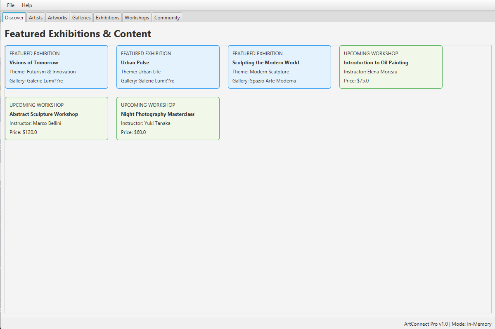
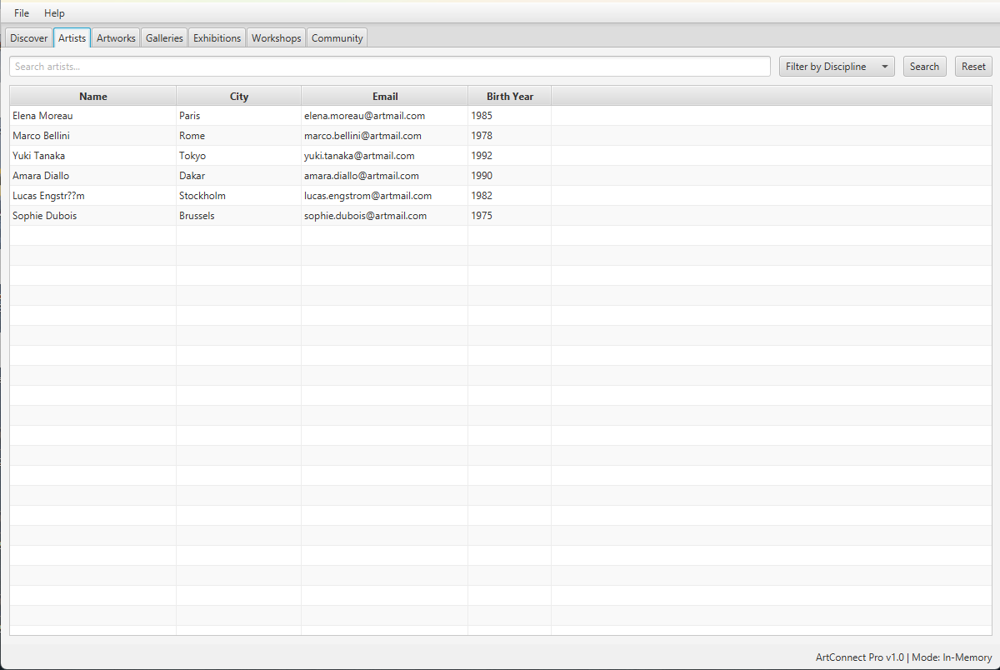
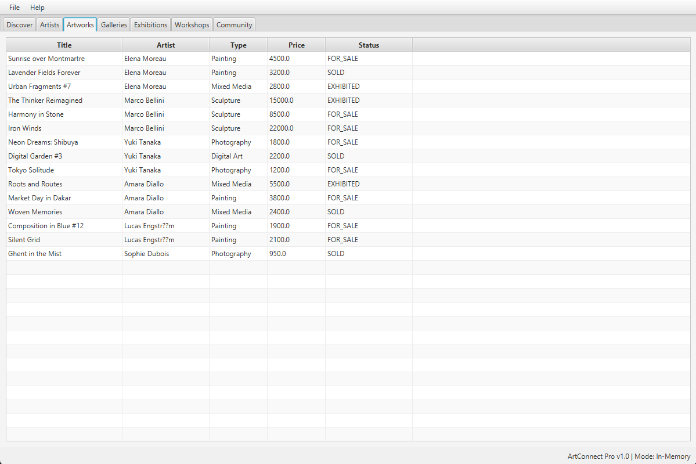
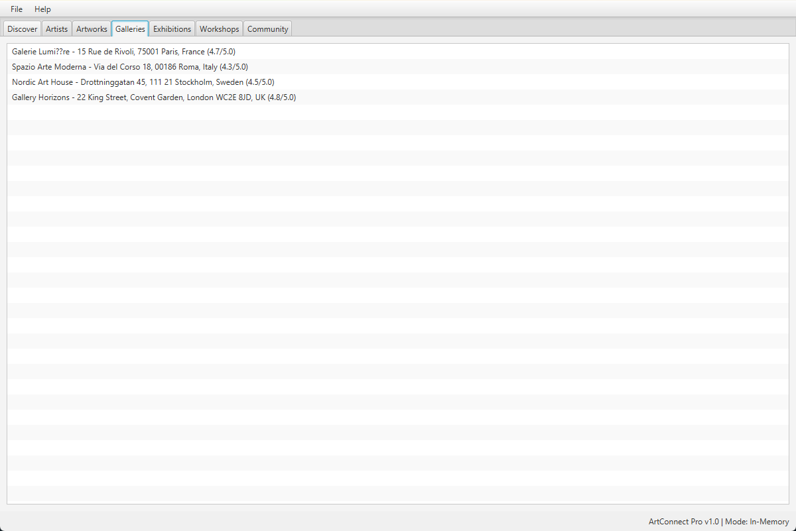
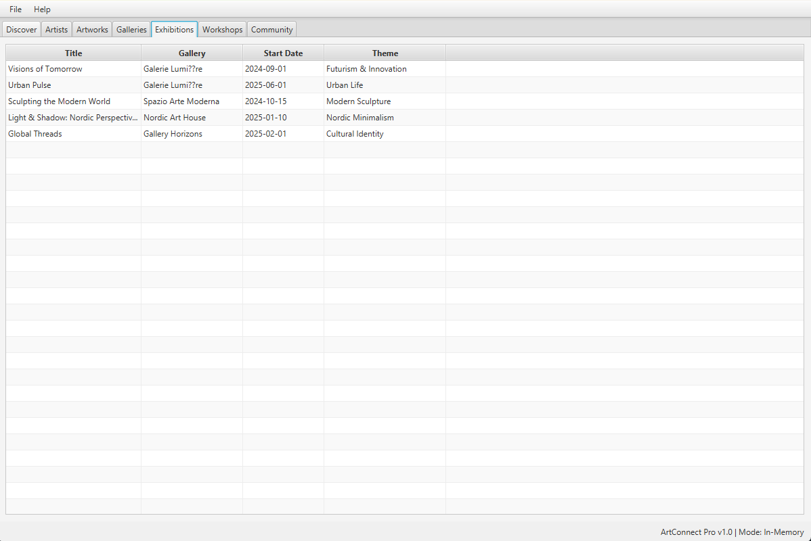
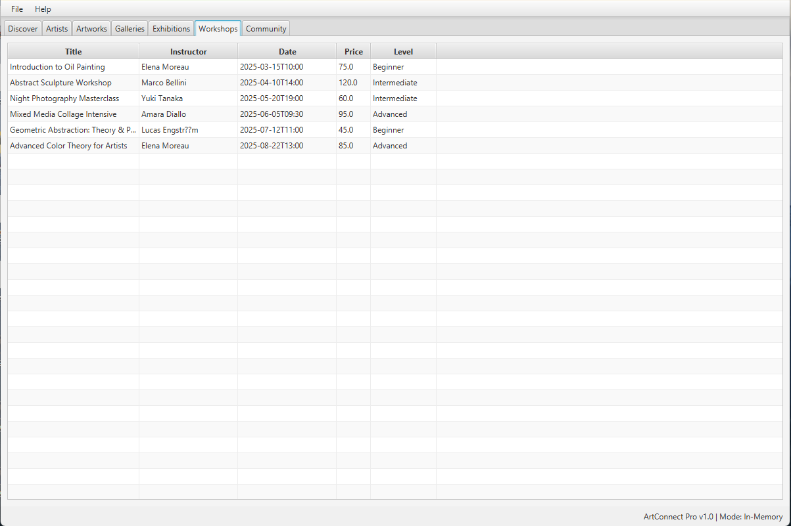
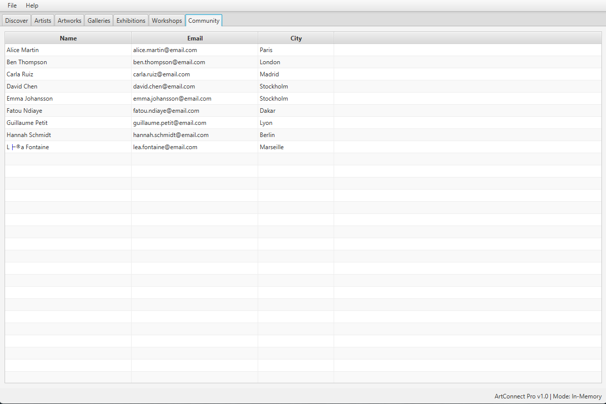

# Step 4 Deliverable — JDBC Integration (ArtConnect Pro)

---

## 1. Architecture Description

### 1.1 Layered Architecture (3-Tier)

The application follows a **3-tier layered architecture** separating concerns into UI, Service, and Persistence layers, connected to a MySQL database.

```
┌─────────────────────────────────────────────────────┐
│                   UI Layer (JavaFX)                  │
│         MainApp.java + FXML Controllers             │
│    (MainView, ArtistTab, ArtworkTab, etc.)          │
└──────────────────────┬──────────────────────────────┘
                       │ uses
┌──────────────────────▼──────────────────────────────┐
│               Service Layer (Interfaces)            │
│  ArtistService, ArtworkService, GalleryService,     │
│  WorkshopService, CommunityService                  │
│                                                     │
│  Implementations: JdbcArtistService,                │
│  JdbcArtworkService, JdbcGalleryService,            │
│  JdbcWorkshopService, JdbcCommunityService          │
└──────────────────────┬──────────────────────────────┘
                       │ delegates to
┌──────────────────────▼──────────────────────────────┐
│            DAO / Persistence Layer (JDBC)           │
│  Interfaces: ArtistDao, ArtworkDao, ExhibitionDao,  │
│  GalleryDao, WorkshopDao, CommunityMemberDao        │
│                                                     │
│  Implementations: JdbcArtistDao, JdbcArtworkDao,    │
│  JdbcExhibitionDao, JdbcGalleryDao,                 │
│  JdbcWorkshopDao, JdbcCommunityMemberDao            │
└──────────────────────┬──────────────────────────────┘
                       │ JDBC (PreparedStatement)
┌──────────────────────▼──────────────────────────────┐
│         Database Layer (MySQL - artconnect)          │
│  ConnectionManager + DatabaseConfig                 │
│  (credentials loaded from database.properties)      │
└─────────────────────────────────────────────────────┘
```

### 1.2 Simplified Class Diagram

```
┌──────────────┐     ┌──────────────────┐     ┌──────────────────┐
│ «interface»  │     │ «interface»      │     │                  │
│  ArtistDao   │◄────│  ArtistService   │◄────│  UI Controllers  │
└──────┬───────┘     └───────┬──────────┘     └──────────────────┘
       │ implements          │ implements
┌──────▼───────┐     ┌───────▼──────────┐
│JdbcArtistDao │     │JdbcArtistService │
└──────────────┘     └──────────────────┘

(Same pattern for Artwork, Exhibition, Gallery, Workshop, CommunityMember)
```

### 1.3 Dependency Injection

`ServiceProvider.java` acts as a **manual dependency injector** (singleton factory), wiring JDBC DAOs into JDBC Services:

```java
// ServiceProvider.java (simplified)
private static final JdbcArtistDao artistDao = new JdbcArtistDao();
private static final ArtistService artistService = new JdbcArtistService(artistDao);
// ... same for all other services
```

---

## 2. Entity Classes (Model Layer)

Package: `com.project.artconnect.model`

| Entity            | Key Fields                                                       |
|-------------------|------------------------------------------------------------------|
| `Artist`          | name, bio, birthYear, disciplines, contactEmail, city, isActive  |
| `Artwork`         | title, creationYear, type, medium, price, status, artist         |
| `Exhibition`      | title, startDate, endDate, gallery, curatorName, artworks        |
| `Gallery`         | name, address, ownerName, rating, exhibitions                    |
| `Workshop`        | title, date, durationMinutes, maxParticipants, price, instructor |
| `CommunityMember` | name, email, birthYear, city, membershipType, bookings, reviews  |
| `Booking`         | workshop, member, bookingDate, paymentStatus                     |
| `Review`          | reviewer, artwork, rating, comment, reviewDate                   |
| `Discipline`      | name                                                             |
| `ArtworkTag`      | name                                                             |

---

## 3. DAO Interfaces

Package: `com.project.artconnect.dao`

```java
// ArtistDao.java
public interface ArtistDao {
    List<Artist> findAll();
    void save(Artist artist);
    void update(Artist artist);
    void delete(String artistName);
    List<Artist> findByCity(String city);
}

// ArtworkDao.java
public interface ArtworkDao {
    List<Artwork> findAll();
    void save(Artwork artwork);
    void update(Artwork artwork);
    void delete(String title);
    List<Artwork> findByArtistName(String artistName);
}

// ExhibitionDao.java
public interface ExhibitionDao {
    List<Exhibition> findAll();
    void save(Exhibition exhibition);
    void update(Exhibition exhibition);
    void delete(String title);
}

// GalleryDao.java
public interface GalleryDao {
    Optional<Gallery> findById(Long id);
    List<Gallery> findAll();
}

// WorkshopDao.java
public interface WorkshopDao {
    Optional<Workshop> findById(Long id);
    List<Workshop> findAll();
}

// CommunityMemberDao.java
public interface CommunityMemberDao {
    Optional<CommunityMember> findById(Long id);
    List<CommunityMember> findAll();
}
```

---

## 4. JDBC DAO Implementations

Package: `com.project.artconnect.persistence`

All implementations use **PreparedStatement** (SQL injection prevention) and **try-with-resources** (safe connection handling).

### JdbcArtistDao — Key highlights
- **Transactional `save`/`update`**: uses `conn.setAutoCommit(false)` to atomically insert/update the artist row + the `artist_discipline` junction table entries.
- **Batch discipline loading**: `loadDisciplinesForArtists()` loads all disciplines in a single query for performance.

### JdbcArtworkDao — Key highlights
- **JOIN on read**: `findAll()` joins `artwork` with `artist` to reconstruct the parent `Artist` object in Java.

### JdbcExhibitionDao — Key highlights
- **Junction table loading**: loads artworks per exhibition via `exhibition_artwork` junction table.
- **Transactional `save`**: atomically inserts exhibition + artwork links.

### JdbcGalleryDao — Key highlights
- **Cascade loading**: automatically loads `Exhibition` objects for each gallery.

### JdbcWorkshopDao — Key highlights
- **Instructor JOIN**: joins with `artist` table to reconstruct the instructor.

### JdbcCommunityMemberDao — Key highlights
- **Complex cascade**: for each member, loads both `Booking` (via `booking` + `workshop` join) and `Review` (via `review` + `artwork` join).

---

## 5. Service Interfaces

Package: `com.project.artconnect.service`

```java
public interface ArtistService {
    List<Artist> getAllArtists();
    Optional<Artist> getArtistByName(String name);
    void createArtist(Artist artist);
    void updateArtist(Artist artist);
    void deleteArtist(String name);
    List<Discipline> getAllDisciplines();
    List<Artist> searchArtists(String query, String disciplineName, String city);
}

public interface ArtworkService {
    List<Artwork> getAllArtworks();
    Optional<Artwork> getArtworkByTitle(String title);
    List<Artwork> getArtworksByArtist(Artist artist);
    void createArtwork(Artwork artwork);
    void updateArtwork(Artwork artwork);
    void deleteArtwork(String title);
}

public interface GalleryService {
    List<Gallery> getAllGalleries();
    Optional<Gallery> getGalleryByName(String name);
    List<Exhibition> getExhibitionsByGallery(Gallery gallery);
}

public interface WorkshopService {
    List<Workshop> getAllWorkshops();
    Optional<Workshop> getWorkshopByTitle(String title);
    void bookWorkshop(Workshop workshop, CommunityMember member);
    List<Booking> getBookingsByMember(CommunityMember member);
}

public interface CommunityService {
    List<CommunityMember> getAllMembers();
    Optional<CommunityMember> getMemberByName(String name);
    List<Review> getReviewsByMember(CommunityMember member);
}
```

---

## 6. JDBC Service Implementations

Package: `com.project.artconnect.service.impl`

| Service                | Delegates to              | Special logic                                    |
|------------------------|---------------------------|--------------------------------------------------|
| `JdbcArtistService`    | `JdbcArtistDao`           | `getAllDisciplines()` via direct SQL query; `searchArtists()` with null-safe city filtering |
| `JdbcArtworkService`   | `JdbcArtworkDao`          | Standard delegation                              |
| `JdbcGalleryService`   | `JdbcGalleryDao`          | Standard delegation                              |
| `JdbcWorkshopService`  | `JdbcWorkshopDao`         | `bookWorkshop()` inserts directly into `booking` table via JDBC |
| `JdbcCommunityService` | `JdbcCommunityMemberDao`  | Standard delegation                              |

---

## 7. Database Connection Layer

### DatabaseConfig.java
Loads credentials from `database.properties` in the classpath (via static initializer block). Falls back to defaults if file not found.

### ConnectionManager.java
Provides `getConnection()` via a **HikariCP connection pool** (max 10 connections, min 2 idle). Connections are reused across queries instead of being opened and closed on every call.

### database.properties
```properties
db.url=jdbc:mysql://localhost:3306/artconnect
db.user=root
db.password=****
```

---

## 8. Screenshots — Application Running with MySQL Database

> Screenshots of the ArtConnect Pro application displaying live data from the `artconnect` MySQL database.

### Discover Tab


### Artists Tab


### Artworks Tab


### Galleries Tab


### Exhibitions Tab


### Workshops Tab


### Community Tab


---

## 9. How to Run

```bash
# 1. Ensure MySQL is running with the artconnect database loaded
# 2. Configure src/main/resources/database.properties with your credentials
# 3. Compile and run:
mvn clean compile
mvn javafx:run
```

**Build verification**: `mvn clean compile` → **BUILD SUCCESS** ✅
